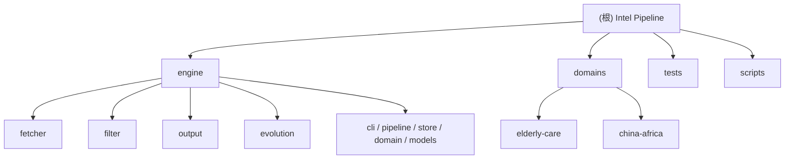

# CLAUDE.md

> Intel Pipeline 架构文档 — AI 辅助开发指引

## 变更记录 (Changelog)

- **2026-06-11**：init-architect 增量扫描 — 补齐 `full_text_fetcher`、全文提取管道阶段、fetcher/evolution 测试覆盖；修正 china-africa `keywords.yaml`/`freshness_days`、elderly-care 7 分类
- **2026-06-10**：init-architect 自适应初始化 — 新增模块结构图、模块索引表、子模块 CLAUDE.md（engine/*、domains/*）、`.claude/index.json`

---

## 项目愿景

**Intel Pipeline** 是一个多领域可插拔的情报采集、筛选、展示引擎。引擎代码（`engine/`）完全领域无关；业务语义通过 `domains/<name>/` 配置注入。当前支持 **elderly-care**（银发产业）和 **china-africa**（中非经贸）。

## 架构总览

### 流水线

```
sources.yaml → [Fetcher] → SQLite(raw_items) → [LLM Filter] → SQLite(scored_items)
                                                                    ↓
                                              [Full Text] 高分条目正文提取 → raw_items.full_text
                                                                    ↓
                                              日报 / API / RSS / 推送
                                                                    ↓
                                              [Evolution] lifecycle + 关键词验证 + 评分校准
```

四个 CLI 阶段：`fetch` → `filter` → `report` → `api`；一键执行 `pipe`（含全文提取 + lifecycle + 关键词验证 + 评分校准 + 可选推送）。

### 技术栈

| 层次 | 技术 |
|---|---|
| 语言 | Python 3.11+ |
| 存储 | SQLite（WAL 模式，每领域独立 DB） |
| LLM | OpenAI 兼容 API（MiMo / GPT 等） |
| Web | FastAPI + Uvicorn |
| CLI | Click + Rich |
| 采集 | httpx, feedparser, BeautifulSoup4 |
| 调度 | APScheduler（`scripts/scheduler.py`） |
| 测试 | pytest + ruff |

### 关键目录

```
intel-pipeline/
├── engine/           # 领域无关引擎核心 → [engine/CLAUDE.md](./engine/CLAUDE.md)
├── domains/          # 领域配置 → [domains/CLAUDE.md](./domains/CLAUDE.md)
├── tests/            # pytest 测试
├── scripts/          # 调度器与启停脚本
├── skills/           # Agent Skill 文档（API 暴露）
├── data/             # 运行时 DB 与日报（gitignore）
└── docs/             # 产品规划文档
```

## 模块结构图



## 模块索引

| 模块路径 | 职责 | 入口 | 文档 |
|---|---|---|---|
| `engine/` | 引擎核心：CLI、管道、存储、模型 | `engine/cli.py` | [engine/CLAUDE.md](./engine/CLAUDE.md) |
| `engine/fetcher/` | 多 kind 信源采集 | `runner.py: fetch_all` | [fetcher/CLAUDE.md](./engine/fetcher/CLAUDE.md) |
| `engine/filter/` | LLM 批量评分 | `pipeline.py: score_items` | [filter/CLAUDE.md](./engine/filter/CLAUDE.md) |
| `engine/output/` | API、RSS、日报、推送 | `api.py: start_api` | [output/CLAUDE.md](./engine/output/CLAUDE.md) |
| `engine/evolution/` | 信源/评分/关键词自动进化 | `cli evolve` | [evolution/CLAUDE.md](./engine/evolution/CLAUDE.md) |
| `domains/` | 领域配置层 | `domain.py: load_domain` | [domains/CLAUDE.md](./domains/CLAUDE.md) |
| `domains/elderly-care/` | 银发产业（54 信源，7 分类） | `sources.yaml` | [elderly-care/CLAUDE.md](./domains/elderly-care/CLAUDE.md) |
| `domains/china-africa/` | 中非经贸（21 信源，8 分类） | `sources.yaml` | [china-africa/CLAUDE.md](./domains/china-africa/CLAUDE.md) |
| `tests/` | pytest 单元/集成测试 | `conftest.py` | — |
| `scripts/` | 调度器与启停脚本 | `scheduler.py` | — |

## 运行与开发

```bash
# 环境
python3 -m venv .venv && source .venv/bin/activate
pip install -e ".[dev]"

# 完整流水线
python -m engine.cli -d elderly-care pipe

# 单步
python -m engine.cli -d elderly-care fetch
python -m engine.cli -d elderly-care filter
python -m engine.cli -d elderly-care report
python -m engine.cli -d elderly-care api          # 默认 8900；多领域见 scripts/start.sh（elderly-care→8901, china-africa→8900）

# 进化分析
python -m engine.cli -d elderly-care evolve all

# 测试
pytest tests/ -v
```

## 环境配置

`.env` 文件（前缀 `INTEL_`）：
- `INTEL_LLM_BASE_URL` / `INTEL_LLM_API_KEY` — LLM API
- `INTEL_LLM_PRE_FILTER_MODEL` / `INTEL_LLM_SCORING_MODEL`
- `INTEL_DOMAIN` — 默认领域
- `INTEL_DB_PATH` — SQLite 路径（默认 `data/intel-{domain}.db`）
- `INTEL_SCORE_WINDOW_DAYS` — LLM 筛选窗口（默认 7）
- `INTEL_NOTIFY_WEBHOOK` — 飞书/企微推送

## 测试策略

| 模块 | 测试文件 | 覆盖 |
|---|---|---|
| store | `test_store.py` | CRUD、去重、查询、`update_full_text` |
| domain | `test_domain.py` | 配置加载 |
| filter | `test_filter.py` | JSON 解析 |
| api | `test_api.py` | REST 端点 |
| fetcher | `test_fetcher.py` | RSS/web 采集、关键词过滤、日期验证、全文提取（mock HTTP） |
| evolution | `test_evolution.py` | keyword_staging、scoring_calibrator/injector、source_lifecycle、source_analyzer、keyword_expander |

## 编码规范

- Python 3.11+，`from __future__ import annotations`
- 类型注解用 `X | None` 而非 `Optional[X]`
- LLM prompt 修改在 `domains/<name>/scoring.md`
- Dashboard 模板在 `engine/output/templates/dashboard.html`

## 关键设计决策

- **采集全量入库**，不做时间过滤；LLM 只筛最近 N 天未评分条目
- **分类独立时间窗口**：`categories.yaml` 的 `freshness_days`，API 按此过滤
- **日期验证**：无日期条目通过 `date_verifier.py` 从原文提取；仍无日期则保留但查询时用 `fetched_at` 容错
- **单轮评分**：当前 `filter/pipeline.py` 直接批量评分（预筛 prompt 已加载但未调用）
- **全文提取**：`pipe` 对 score≥6 条目并发抓取原文正文，写入 `raw_items.full_text`；`RawItem.best_content` 优先返回全文
- **多领域 API 端口**：`scripts/start.sh` 映射 china-africa→8900、elderly-care→8901

## API 端点

```
GET /api/items?domain=elderly-care&mode=selected&days=3
GET /api/categories?domain=elderly-care
GET /api/sources?domain=elderly-care
GET /api/stats?domain=elderly-care
GET /api/trending?domain=elderly-care
GET /api/report/{date}?domain=elderly-care
GET /rss/curated?domain=elderly-care
GET /skill/{skill_name}/SKILL.md
POST /api/sources/{id}/confirm|disable|enable
```

## AI 使用指引

1. **改采集逻辑** → 读 [engine/fetcher/CLAUDE.md](./engine/fetcher/CLAUDE.md)
2. **改评分标准** → 编辑 `domains/<name>/scoring.md`，必要时看 [engine/filter/CLAUDE.md](./engine/filter/CLAUDE.md)
3. **改 API/前端** → [engine/output/CLAUDE.md](./engine/output/CLAUDE.md)
4. **加信源** → 编辑 `domains/<name>/sources.yaml`
5. **加新领域** → 复制 `domains/elderly-care/` 结构，见 [domains/CLAUDE.md](./domains/CLAUDE.md)
6. **扫描覆盖率** → 查看 `.claude/index.json`

## 添加新信源

在 `domains/<name>/sources.yaml` 追加：
```yaml
- id: new_source
  name: 名称
  kind: rss          # rss / web / ageclub / searxng
  url: https://...
  tier: T1           # T1 / T1.5 / T2
  type: general      # policy / research / media / hotlist / overseas / general
  lang: zh
  keywords_filter: false
  tags: [标签]
```

## 常见任务

**测试单个信源采集：**
```bash
python3 -c "
from engine.fetcher.rss_fetcher import fetch_rss
from engine.models import SourceDef, SourceKind
s = SourceDef(id='test', name='test', kind=SourceKind.RSS, url='https://example.com/feed', lang='zh')
items = fetch_rss(s)
print(f'{len(items)} items')
"
```

**查看数据库统计：**
```bash
python3 -c "
from engine.store import Store
s = Store()
rows = s.conn.execute('SELECT source_id, COUNT(*) FROM raw_items GROUP BY source_id').fetchall()
for r in rows: print(f'{r[0]}: {r[1]}')
"
```
