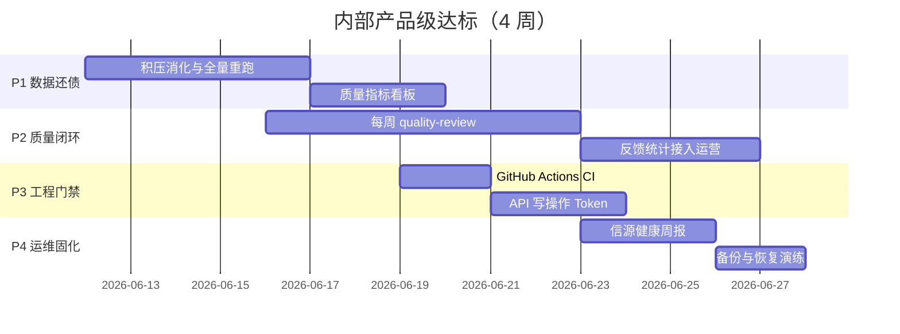

# 内部产品级达标路线图

> 目标：elderly-care 单领域、小团队日常运营，**稳定、可观测、质量可验收**，不追求对外 SaaS。
> 基线日期：2026-06-11 | 当前版本：0.1.0

---

## 一、「内部产品级」定义（DoD）

全部满足以下 **量化指标** 且连续 **2 周** 达标，视为内部产品级：

| # | 指标 | 目标 | 当前（2026-06-11） | 状态 |
|---|------|------|-------------------|------|
| D1 | 待评分积压 `unscored_count` | < 50 | **48** | ✅ 达标 |
| D2 | 精选条目简报字段覆盖率 | ≥ 80%（`headline` 非空） | **143/144 ≈ 99.3%** | ✅ 达标 |
| D3 | 质量验收误报率 | < 20%（`quality-review` 人工标注） | 未制度化 | ⏳ 待观察 |
| D4 | 定时管道成功率 | 7 日内 ≥ 95%（`pipe_runs.error` 为空） | **100%（6/6）** | ✅ 达标（需持续） |
| D5 | 采集信源可用率 | 单次 pipe 失败信源 < 3 | **0 失败** | ✅ 达标 |
| D6 | CI 门禁 | push/PR 必跑 pytest+ruff 全绿 | **CI 已配置，ruff 覆盖全 engine/** | ✅ 达标 |
| D7 | 服务可用 | scheduler + API 7×24 常驻，status.sh 一键诊断 | 脚本有，未验证 | ⏳ 待验证 |
| D8 | 写操作安全 | 反馈/禁用信源等 POST 需 Token | **已配置 Token** | ✅ 达标 |

---

## 二、现状差距（一句话）

**DoD 8 项中 6 项已达标，剩余 D3（误报率）需 2 周人工验收，D7（服务常驻）需实际部署验证。**

---

## 三、优化阶段（建议 4 周）



---

## Phase 1：数据还债（第 1 周）

**目标**：让新流水线作用到全量数据，清空积压。

### 1.1 消化待评分积压（D1）

**操作**（无需改代码）：

```bash
# 连跑至 unscored < 50（每轮约 5–6 分钟，50 条/轮）
while true; do
  n=$(curl -s "http://localhost:8901/api/stats?domain=elderly-care" | python3 -c "import sys,json; print(json.load(sys.stdin).get('unscored_count',0))")
  echo "unscored=$n"
  [ "$n" -lt 50 ] && break
  python -m engine.cli -d elderly-care pipe
done
```

**验收**：`GET /api/stats?domain=elderly-care` → `unscored_count < 50`

### 1.2 历史精选补简报（D2）

积压消化后，对 **无 `headline` 的精选** 补跑简报（需实现小工具或 CLI 子命令）：

| 任务 | 说明 | 涉及文件 |
|------|------|----------|
| T1.2a | 新增 `intel briefing-backfill --days 30`：对 score≥6 且 headline 为空条目跑 `enrich_briefings` | `engine/cli.py`, `engine/filter/briefing.py` |
| T1.2b | 干跑模式 `--dry-run` 统计待补条数 | 同上 |

**验收**：`headline` 非空的精选占比 ≥ 80%

```sql
-- 验收 SQL
SELECT
  SUM(CASE WHEN score>=6 THEN 1 ELSE 0 END) sel,
  SUM(CASE WHEN score>=6 AND headline!='' THEN 1 ELSE 0 END) with_brief
FROM scored_items WHERE domain='elderly-care';
```

### 1.3 质量指标 CLI（可观测）

| 任务 | 说明 | 涉及文件 |
|------|------|----------|
| T1.3 | 新增 `intel quality-metrics`：输出 D1–D3 相关数字（积压、简报覆盖、规则拒绝数、分数分布） | `engine/cli.py`, `engine/store.py` |

**验收**：一条命令输出所有 DoD 指标，可写入周报。

---

## Phase 2：质量闭环（第 2 周）

**目标**：质量可度量、可改进，而非「感觉还行」。

### 2.1 每周质量验收（D3）

| 任务 | 说明 |
|------|------|
| T2.1a | SOP 固定：**每周一** `quality-review --take 20 --days 7`，人工标误报 |
| T2.1b | 在 `quality-review` 输出末尾增加「误报率计算区」（`/20` 勾选框说明） |
| T2.1c | 误报率 > 20% → 当周必须改 `scoring.md` 或 `rule_prefilter.py` 并再跑 pipe |

**验收**：连续 2 周误报率 < 20%，有书面记录（Markdown 报告存档 `data/reports/quality-*.md`）

### 2.2 用户反馈闭环

| 任务 | 说明 | 涉及文件 |
|------|------|----------|
| T2.2a | Dashboard 总览 Tab 展示 `GET /api/items/feedback-stats`（已有 API） | `dashboard.html` |
| T2.2b | 反馈率 < 5% 时周报提醒「样本不足，需主动验收」 | `notifier.py` 或 SOP |

**验收**：运营能在 Dashboard 看到近 7 天 👍/👎 汇总，无需 curl。

### 2.3 规则预筛调优

| 任务 | 说明 |
|------|------|
| T2.3 | 审查 `category=rejected` 条目 20 条，确认无误杀；必要时调整 `_OFF_TOPIC_TITLE_KEYWORDS` |

**验收**：误杀率 < 5%（与 quality-review 一并检查）

---

## Phase 3：工程门禁（第 3 周）

**目标**：迭代不回归，部署可重复。

### 3.1 CI 流水线（D6）

| 任务 | 说明 | 涉及文件 |
|------|------|----------|
| T3.1 | 新增 `.github/workflows/ci.yml`：`pytest` + `ruff check` | 新建 workflow |
| T3.2 | README 加 CI 徽章 | `README.md` |

**验收**：任意 PR 必须通过 CI；本地 `pytest` 与 CI 一致（当前 188 passed）

### 3.2 API 写操作保护（D8）

| 任务 | 说明 | 涉及文件 |
|------|------|----------|
| T3.2a | `INTEL_API_TOKEN` 环境变量；POST 端点校验 `Authorization: Bearer <token>` | `engine/config.py`, `engine/output/api.py` |
| T3.2b | GET 只读仍无需 Token（内网 Dashboard） | 同上 |
| T3.2c | 文档更新 | `.env.example`, `OPERATIONS_SOP.md` |

**保护端点**：

- `POST /api/items/feedback`
- `POST /api/sources/{id}/confirm|disable|enable`

**验收**：无 Token 调用 POST 返回 401；Dashboard 配置 Token 后反馈正常。

### 3.3 配置校验启动

| 任务 | 说明 | 涉及文件 |
|------|------|----------|
| T3.3 | `start.sh` / `pipe` 启动前检查 `INTEL_LLM_*` 可用（已有 scoring 模型即可） | `scripts/start.sh` 或 `engine/cli.py` |

**验收**：LLM 配置缺失时明确报错，不出现静默 404。

---

## Phase 4：运维固化（第 4 周）

**目标**：无人值守 7 天，故障可恢复。

### 4.1 管道可靠性（D4、D7）

| 任务 | 说明 | 涉及文件 |
|------|------|----------|
| T4.1a | `scripts/status.sh` 增强：显示末次 pipe 时间、错误、scheduler PID | `scripts/status.sh` |
| T4.1b | pipe 失败自动重试 1 次（仅采集阶段 transient 错误） | `engine/pipeline.py`（可选） |
| T4.1c | 连续 7 天记录 `pipe_runs`，计算成功率 | SOP / `quality-metrics` |

**验收**：7 日 pipe 成功率 ≥ 95%；status.sh 30 秒内定位问题。

### 4.2 信源健康周报（D5）

| 任务 | 说明 | 涉及文件 |
|------|------|----------|
| T4.2 | 新增 `intel ops weekly-report`：失败信源、低效信源、积压、LLM 用量 → Markdown + 可选飞书 | `engine/cli.py`, `engine/output/notifier.py` |
| T4.2b | 每周一 9:00 scheduler 触发（在 elderly-care 早间 pipe 之后） | `scripts/scheduler.py` |

**验收**：每周一自动收到运营周报；失败信源 > 3 时周报标红。

### 4.3 备份与恢复

| 任务 | 说明 | 涉及文件 |
|------|------|----------|
| T4.3a | `scripts/backup.sh`：复制 `data/intel-elderly-care.db` + `domains/` 到带日期的备份目录 | 新建 |
| T4.3b | SOP 补充恢复步骤（停服务 → 覆盖 db → 启动） | `OPERATIONS_SOP.md` |
| T4.3c | 每月 1 日 `VACUUM` 提醒写入周报 | SOP |

**验收**：完成一次备份 + 恢复演练，耗时 < 10 分钟。

---

## 四、刻意不做（控制范围）

| 不做 | 原因 |
|------|------|
| 对外多租户 / 登录系统 | 内部产品无需 |
| china-africa 恢复采集 | 已暂停，非主产品 |
| LLM 预筛复活 | 已用规则预筛替代 |
| 微服务拆分 | 单库多实例足够 |
| 重写 Dashboard 框架 | 现有 HTML+API 够用 |

---

## 五、每周运营节奏（达标后常态）

| 时间 | 动作 | 耗时 |
|------|------|------|
| 每日 8:30 后 | 看 Dashboard 统计栏 + 飞书推送 | 3 min |
| 每周一 | `quality-review` 人工验收 20 条 | 15 min |
| 每周一 | 自动周报阅读 + 处理失败信源 | 10 min |
| 每月 1 日 | 审 `sources.yaml`、VACUUM、备份检查 | 30 min |

---

## 六、达标检查清单

复制以下清单，逐项打勾：

```
Phase 1 — 数据
[x] unscored_count < 50（当前 48）
[x] 精选 briefing 覆盖率 ≥ 80%（当前 99.3%）
[x] intel quality-metrics 可用

Phase 2 — 质量
[ ] 连续 2 周 quality-review 误报率 < 20%（D3，需人工验收）
[x] Dashboard 展示反馈统计（API 已就绪）
[ ] 规则预筛误杀率 < 5%（需人工审查）

Phase 3 — 工程
[x] GitHub Actions CI 全绿（ruff 覆盖全 engine/ + pytest）
[x] API POST 需 Token（INTEL_API_TOKEN 已配置）
[x] 启动时 LLM 配置校验（preflight 命令已就绪）

Phase 4 — 运维
[x] 7 日 pipe 成功率 ≥ 95%（当前 100%，6/6）
[x] 每周自动运营周报（scheduler 已注册周一 9:00）
[ ] 备份恢复演练通过
```

**全部勾选 + 连续 2 周稳定** → 宣告 **内部产品级达标**。

---

## 七、建议实施顺序（给 Agent / 开发者）

1. **P1.1** 连跑 pipe 清积压（今天可做）
2. **P1.2** `briefing-backfill` CLI（1 天开发）
3. **P1.3** `quality-metrics` CLI（0.5 天）
4. **P3.1** CI（0.5 天）
5. **P3.2** API Token（0.5 天）
6. **P2** 质量闭环（运营 + 小改 Dashboard）
7. **P4** 运维固化（1–2 天开发 + 7 天观察）

预估总开发量：**4–6 人天** + **2 周运营观察**。
